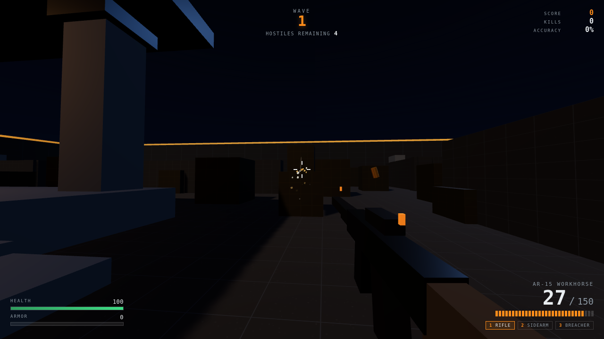

# First Gun Game

A small arena FPS that runs in the browser. Vanilla JavaScript + [three.js](https://threejs.org) — **no game engine, no build step, no asset files**. Clone it, run one command, play.



> **Status: v0.1.0 — first playable version, browser-verified.** Single-player wave survival. See [Testing](#testing) for the verification story and [Roadmap](#roadmap) for what is deliberately not here yet.

---

## Run it

```bash
git clone https://github.com/YOUR-USERNAME/First-Gun-Game.git
cd First-Gun-Game
node server.js
# -> http://localhost:8080
```

That's it. No `npm install` — the project has zero dependencies. A tiny static server (`server.js`) is included because ES modules cannot be loaded over `file://`.

Change the port with `PORT=3000 node server.js`.

## Controls

| Input | Action |
| --- | --- |
| `W` `A` `S` `D` | Move |
| Mouse | Look |
| Left click | Fire |
| `Space` | Jump |
| `Shift` | Sprint |
| `R` | Reload |
| `1` `2` `3` | Rifle / Sidearm / Breacher |
| Mouse wheel | Cycle weapon |
| `Esc` | Pause |

Click **DEPLOY**, then click the game once to capture the mouse.

---

## What's in v0.1.0

- **Three hitscan weapons** — rifle (full-auto), pistol, shotgun (9 pellets), each with its own damage, rate of fire, magazine, reload time, recoil pattern and spread behaviour.
- **Recoil that recovers.** Camera kick is tracked separately from player aim so it settles smoothly instead of fighting your mouse input.
- **Dynamic cone of fire.** Spread widens while moving and in the air; the reticle grows to match so you can read your own accuracy.
- **Four enemy classes** — Grunt, Runner, Heavy, Marksman — each with its own health, speed, damage, engagement range and aim cone.
- **Enemy AI** that closes to a preferred range, strafes, avoids cover and other bots, and only fires with real line of sight.
- **Symmetrical hit-scan.** Enemies use the same raycast rules as the player, so **cover genuinely works in both directions**.
- **Endless wave director** with drip-fed spawning, escalating counts and per-wave stat scaling.
- **Headshots** at a damage multiplier, with distinct hitmarkers and killfeed entries.
- **Health / armor / ammo pickups** dropped by kills.
- **Health regen** after 5 seconds without taking damage.
- **Procedural audio.** Every sound — gunfire, reloads, impacts, hitmarkers, footsteps, the wave fanfare — is synthesised at runtime with the Web Audio API. Not one `.wav` in the repo.
- **Procedural textures.** Floor, walls and crates are drawn to canvases at boot. Not one `.png` in the repo.
- **Pooled effects** — tracers, sparks, blood, shell casings, bullet holes, impact rings.
- **Damage direction indicators**, screen shake, hit flash, low-health pulse.
- **Fixed-timestep physics** so movement feels identical at 30 fps and 240 fps.
- **Gray-box arena** — centre platform with four pillars, corner bunkers, mid-field walls, seeded crate scatter.

---

## How the code is organised

```
First-Gun-Game/
├── index.html          DOM shell: canvas + HUD + menus
├── server.js           dependency-free static dev server
├── css/style.css       HUD and menu styling
├── vendor/
│   └── three.module.js three.js r160 (vendored — game runs offline)
└── js/
    ├── main.js         bootstrap, state machine, frame loop, wave director
    ├── config.js       EVERY tunable number lives here
    ├── three.js        re-export shim for the vendored engine
    ├── mathutil.js     ray vs AABB, ray vs sphere, PRNG, damp/lerp
    ├── world.js        arena geometry, colliders, lighting, spawn points
    ├── player.js       first-person controller, collision, health
    ├── weapons.js      weapon table, hit-scan firing, recoil, viewmodel
    ├── enemies.js      bot state machine, AI, enemy firing
    ├── effects.js      pooled tracers, sparks, casings, decals
    ├── pickups.js      health / armor / ammo drops
    ├── hud.js          DOM HUD updates
    ├── input.js        keyboard, mouse, pointer lock
    └── audio.js        Web Audio synthesiser
```

Full write-up in **[docs/ARCHITECTURE.md](docs/ARCHITECTURE.md)**.

### Balancing the game

Every gameplay number is in **`js/config.js`**. Want a shotgun that one-shots? Change `damage: 15` to `damage: 40`. Want enemies twice as fast? Change `SPEED_SCALE`. Reload the page and feel it. Nothing else needs touching.

### Poking at a running game

`main.js` publishes a debug handle, so you can experiment from the browser console:

```js
__fgg.player.health = 1              // test the death screen
__fgg.state.score += 9999
__fgg.weapons.current.reserve = 999  // infinite ammo
__fgg.state.wave                     // what wave am I on?
__fgg.enemies.aliveCount
```

---

## Design decisions worth knowing

**Why hit-scan instead of projectile bullets?** Instant, deterministic, and the same code path works for the player and the AI. Projectile ballistics are a later feature, not a foundation.

**Why analytical ray casting instead of `THREE.Raycaster`?** The level is axis-aligned boxes and enemies are two spheres each. `rayAABB` and `raySphere` in `mathutil.js` are exact for those shapes, allocation-free, and fast enough for a shotgun's 9 pellets × 14 enemies every frame.

**Why no engine?** The point of the project is to see how an FPS actually works. Every system — collision, recoil, AI, wave pacing — is readable in a few hundred lines instead of hidden behind an editor.

**Why is three.js vendored instead of pulled from a CDN?** The game works with no network connection, and the repo can never break because a CDN changed a URL. Upgrading is a one-file swap behind the `js/three.js` shim.

**Why pooled effects?** A firefight spawns hundreds of short-lived objects per second. Creating a `Mesh` per tracer would thrash the garbage collector and stutter the frame rate.

---

## Testing

The game ships with a real, browser-driven test suite: **`tests/play.test.js`**.

It launches headless Chromium and runs two phases:

- **Integration** — the actual render loop runs; asserts the game boots, renders,
  throws nothing, and 404s nothing.
- **Logic** — the render loop is frozen and `step(1/120)` is driven by hand so the
  simulation runs at true speed even on software WebGL. Covers movement, sprint,
  jump, collision, weapon switch, reload, full-auto vs semi-auto, body/headshot
  damage, kills & score, cover blocking bullets, wave director, enemy fire,
  pickups, armor math, death and restart.

Run it:

```bash
npm install          # dev-only; installs Puppeteer + Chromium. The GAME itself
                     # still has zero runtime dependencies.
node server.js &     # in another terminal
npm test             # 43 assertions
```

As of v0.1.0 the suite reports **43 passed, 0 failed**.

Screenshots from the suite: [docs/screenshot-menu.png](docs/screenshot-menu.png),
[docs/screenshot-gameplay.png](docs/screenshot-gameplay.png).

## Roadmap

Ordered roughly by how much they improve the feel per hour of work.

- [ ] **Verify in a real browser** and fix whatever surfaces (see above)
- [ ] Aim down sights (right mouse) with FOV kick
- [ ] Weapon sway and a proper sprint/lower animation
- [ ] More maps, or a map loader so levels are data instead of code
- [ ] Grenades and explosive radius damage
- [ ] Enemy variety: a melee rusher, a shielded unit, a boss
- [ ] Sound occlusion and reverb zones
- [ ] Multiplayer. The hit-scan model is already deterministic and server-authoritative-friendly; a WebSocket server relaying player transforms plus fire events is the natural next step
- [ ] Mobile touch controls

---

## License

MIT — see [LICENSE](LICENSE). Bundled three.js is MIT, © 2010-2023 three.js Authors.
